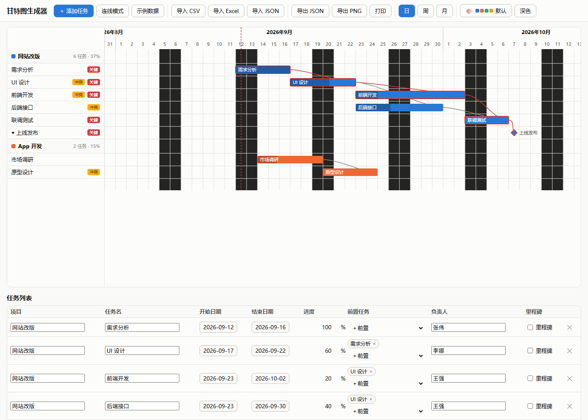
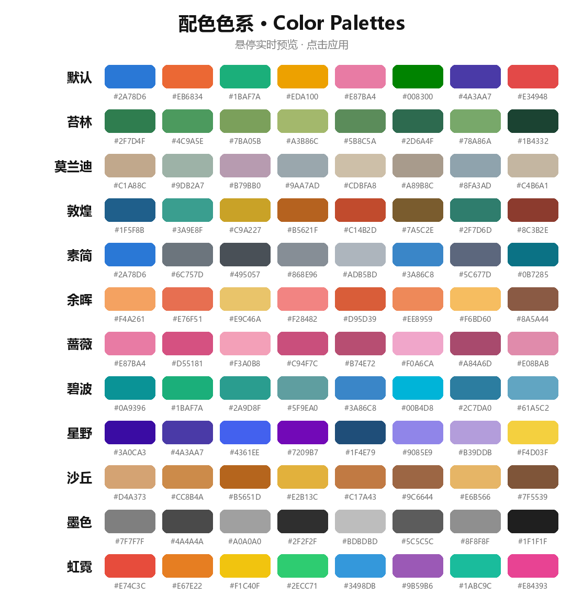

<div align="center">

# [甘特图生成器](https://cecilia11-cc.github.io/gantt-chart/)

<a href="https://cecilia11-cc.github.io/gantt-chart/"></a>
<a href="https://github.com/Cecilia11-cc/gantt-chart"></a>
<a href="./LICENSE"></a>

**在线访问：<https://cecilia11-cc.github.io/gantt-chart/>**

一个纯前端、零安装依赖的甘特图软件 —— 双击 `index.html` 即可在浏览器中使用，数据保存在本地浏览器。

</div>

## 示例图



## 色系图谱

内置 12 套配色，工具栏「🎨 配色」中**悬停实时预览、点击应用**，并支持自定义色系：



## 功能

- **手动编辑**：任务表格增删改（项目 / 名称 / 起止 / 进度 / 前置 / 负责人 / 里程碑）
- **滚轮日期选择**：日期字段用「年 / 月 / 日」三列滚轮选择
- **拖拽交互**：拖动条形移动日期、拖左右边缘改起止；日 / 周 / 月三档缩放；今天线
- **依赖与关键路径**：连线模式建立任务依赖；自动计算关键路径（红色高亮）；拖拽后自动顺延下游
- **多项目 & 资源**：按项目分组汇总；同一负责人任务时间重叠时给出「冲突」标记
- **色系系统**：12 套预置配色 + 自定义色系，悬停实时预览
- **导入导出**：CSV / Excel / JSON 导入；PNG 图片、JSON 导出；打印
- **主题**：浅色 / 深色；数据本地自动保存

## 使用

直接双击 `index.html` 用浏览器打开即可。Excel 导入需要联网加载 SheetJS 解析库（离线时可用 CSV）。

## 文件结构

```
gantt-chart/
├── index.html       页面骨架
├── style.css        样式
├── themes.js        色系数据与持久化
├── data.js          数据模型 / 日期工具 / 本地存储
├── scheduler.js     排期引擎（关键路径 / 自动顺延 / 资源冲突）
├── gantt.js         SVG 渲染与拖拽交互
├── table.js         可编辑表格 + 滚轮日期选择器
├── themeui.js       色系选择面板
├── import.js        CSV / Excel / JSON / PNG 导入导出
└── app.js           主控制器
```

## 许可证

[MIT](LICENSE)
